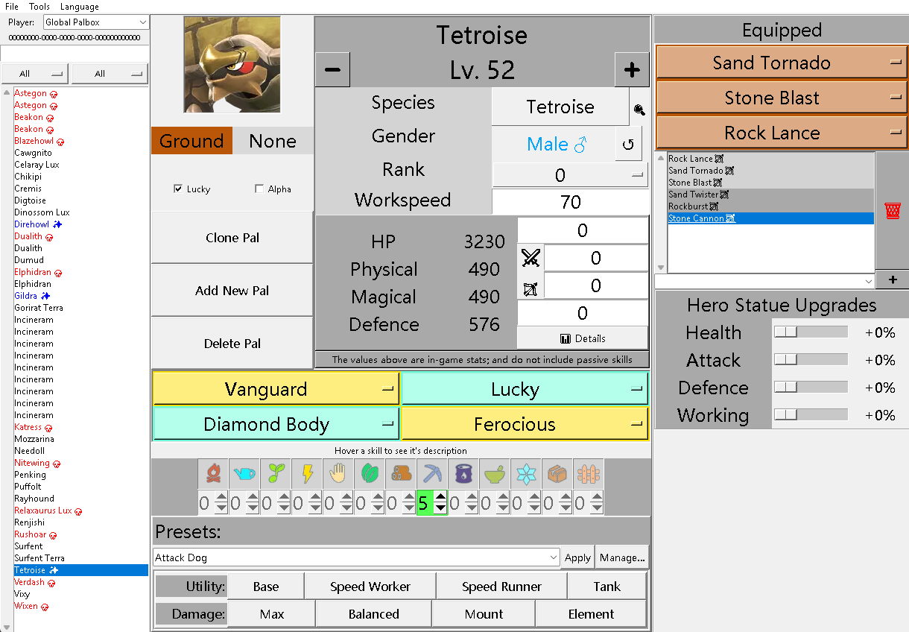
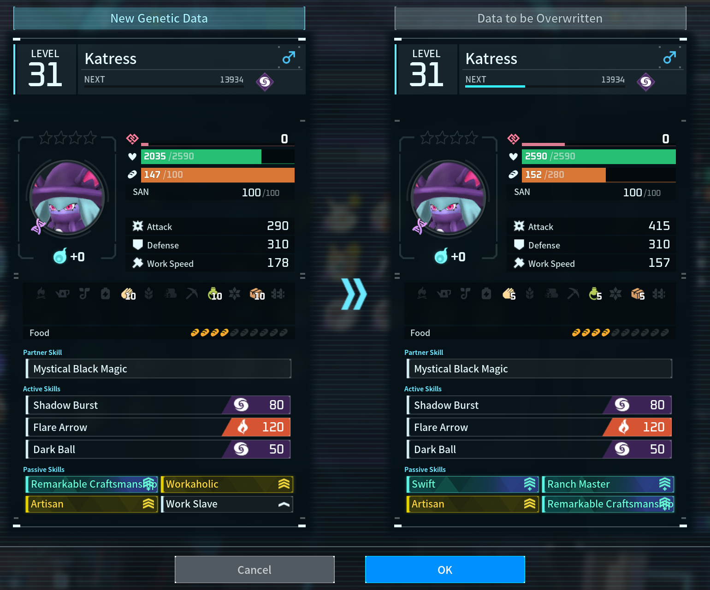
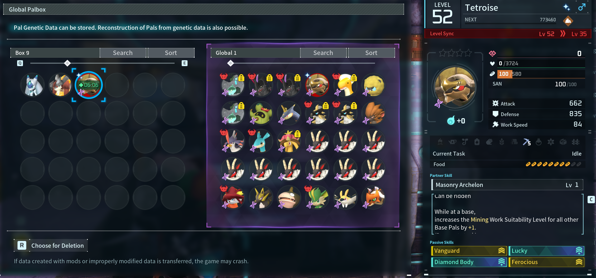

<h1 align="center">PalEdit</h1>

<div align="center">

[](https://github.com/EternalWraith/PalEdit/pulls)
[](https://github.com/EternalWraith/PalEdit/issues)

<br>
**A simple tool for editing and generating Pals within PalWorld saves.**

</div>

---

<div align="center">

# 🎉 Now updated for Palworld 1.0! 🐢

**A community fork of [EternalWraith's PalEdit](https://github.com/EternalWraith/PalEdit), rebuilt for the Palworld 1.0 save format** — with Global Palbox editing, save-safe writing, and a stack of quality-of-life features.

</div>

## ✨ What's new in the 1.0 update

- 🐣 **Palworld 1.0 - GlobalPalBox support** — reads & writes the new save format, loads the **Global Palbox** (`GlobalPalStorage.sav`), refreshed 1.0 species / moves / passives / icons, level cap raised to 80.
- 🛡️ **Save-safe** — opening a file and saving it back changes *nothing* unless you actually edit something (verified with a field-by-field comparison of every pal). It also tidies up leftover data from earlier versions — including the issue that made unassigned pals idly **"graze"** and produce nothing.
- 📦 **Global Palbox management** — **add, clone, delete, and rename** pals right in the box.
- 🔎 **Searchable everything:**
  - **Attacks** — filter by element, sort by damage, toggle learnset / fruit-teachable / all.
  - **Passives** — grouped by effect with **accurate descriptions** (e.g. *Lucky → Attack +15%, Defense +15%, Work Speed +20%*) shown on hover.
  - **Species browser** — search + element / category / work-suitability / NPC-type filters, with internal codes shown so merchants and special NPCs are easy to find.
  - **Pal-list filter bar** — search, element, and category over your loaded box.
- 🎚️ **Work suitabilities 0–10** with grey / green / red feedback (grey = base, green = boosted, red = mutation/cheat range).
- 📊 **Detailed stats popup** — current vs level-standard stats, plus IV, soul and condensation contributions.
- ⭐ **Custom passive presets** — build named passive sets and stamp them onto any pal.
- 💾 **Automatic per-session backups** — your save is copied to a `PalEdit-backups` folder before the first write.

> [!TIP]
> Editing focus so far has been the **Global Palbox**. As with any save editor, keep your own backups too. NPC/merchant editing works inside PalEdit but using them in-game is still experimental.

> ⚠️ **Before Opening a new Issue**: Please check the [**🚧 Project roadmap**](#-project-roadmap) section to ensure that your concern or feature request hasn't already been addressed or is planned for a future release. Also check the [Open Issues](https://github.com/EternalWraith/PalEdit/issues).

## **📚 Table of Contents**

- [**🚀 Installation**](#-installation)
- [**⚠️ A word of warning**](#️-a-word-of-warning)
- [**🕹️ Usage**](#️-usage)
- [**💾 Adding, cloning & deleting Pals**](#-adding-cloning--deleting-pals)
- [**📦 Backing up your save**](#-backing-up-your-save)
- [**🛠️ Building from source (on Windows)**](#️-building-from-source-on-windows)
- [**🚧 Project roadmap**](#-project-roadmap)

## **🚀 Installation**

Download the compiled executable from [Releases Page](https://github.com/TheMysticTurtle/PalEdit/releases).

## **⚠️ A word of warning**

> [!CAUTION]
> This fork now makes an **automatic backup** of the loaded save (into a `PalEdit-backups` folder next to it) before its first write each session — but it is still wise to keep your own backups of ALL save files before using the tool.
> For more information, see the [**📦 Backing up your save**](#-backing-up-your-save) section.

## **🕹️ Usage**

This fork focuses on your **Global Palbox** — the shared Pal storage you reach
through the *Pal Genetic Data* terminal in-game.

> [!IMPORTANT]
> **The Global Palbox (`GlobalPalStorage.sav`) is the only save file tested and
> working right now.** Editing a world's `Level.sav` isn't enabled yet — the
> groundwork and the remaining steps are written up in
> [docs/save-editing-analysis.md](docs/save-editing-analysis.md). Please stick to
> the Global Palbox for now, and keep a backup.



1. **Download & run.** Grab the latest build from the [Releases page](https://github.com/TheMysticTurtle/PalEdit/releases), extract the zip into a folder anywhere, and run **`PalEdit.exe`**.
2. **Load your save.** Choose **File → Load Save** and open your **`GlobalPalStorage.sav`**. On Windows it lives at:

    ```
    %LocalAppData%\Pal\Saved\SaveGames\<your-account-id>\GlobalPalStorage.sav
    ```

    (there's one numbered folder per account — see [Backing up your save](#-backing-up-your-save) for how to find it.)
3. **Edit away.** You'll see every Pal in your Global Palbox. Select one to change its level, stats/IVs, souls, moves, passives, nickname or species, or use **Add New Pal**, **Clone Pal** and **Delete Pal** to manage the box (see [Adding, cloning & deleting Pals](#-adding-cloning--deleting-pals)).
4. **Save.** Choose **File → Save**. The first save of each session automatically copies your original file into a `PalEdit-backups` folder next to it, just in case.
5. **Pick your changes up in-game** — see below.

### 🎮 Getting your edits into the game

Open the **Global Palbox** at a *Pal Genetic Data* terminal. Your edited and newly
added Pals sit on the Global side; move them into a local box to use them:

- **Edited an existing Pal?** Drag it from the Global Palbox into your local box — the changes are there **right away**. The game shows the new genetic data next to what it's replacing:

  

- **Added a brand-new Pal?** Drag it onto an **empty slot** in your local box. Freshly reconstructed Pals sit on a short cooldown (around **10 minutes**), after which they behave just like any other Pal:

  

> [!TIP]
> **Edit with Palworld closed.** Close the game before you load your save in PalEdit,
> and launch it again once you've saved. While the game is running it keeps the palbox
> in memory and can overwrite your changes on its next autosave, so editing with it
> shut is the safe way to go. Your edits appear the next time you open the *Pal Genetic
> Data* terminal — and if anything ever looks off, you still have the automatic
> `PalEdit-backups` copy (and your own backup) to fall back on.

## **💾 Adding, cloning & deleting Pals**

Right in the Global Palbox, next to the portrait:

- **Clone Pal** — makes an exact copy of the selected Pal in a free slot. Great for duplicating a favourite before experimenting.
- **Add New Pal** — drops a fresh Pal into the box (it starts as a default species; change it with the **Species** picker, then edit its level, moves, passives and stats to taste).
- **Delete Pal** — clears the selected slot after a confirmation.

Cloned and newly added Pals arrive through the same in-game flow as above: drag them
onto an empty slot in a local box, wait out the short reconstruction cooldown, and
they're ready to go.

## **📦 Backing up your save**

This fork automatically copies the loaded save into a `PalEdit-backups` folder (next
to the save) before its first write each session. That's a safety net, not a
replacement for your own backups — it's still wise to keep a copy of your save files
somewhere safe before editing.

On Windows, the saves can be found here:

- `%LocalAppData%\Pal\Saved\SaveGames\`

You'll find one folder per account (a long numbered name); your **`GlobalPalStorage.sav`**
is inside it.

If you’ve installed Palworld via Steam, you can also access your save files by following these steps:

1. Open your Steam library.
2. Right-click on Palworld, then select Manage > Browse local files.
3. This will open the folder where Palworld’s installed files are stored, named Pal.
4. From here, go to Saved > SaveGames to access your save files for the game.

## **🛠️ Building from source (on Windows)**

1. Install Python, at least version 3.10 (for the CI/CD pipeline we are using Python 3.12.1). You can get it from [here](https://www.python.org/downloads/windows/). Don't forget to check the box to add Python to your PATH.
2. Open a PowerShell window in the root of the project.
3. Create a virtual environment:

    ```powershell
    python -m venv venv
    ```

4. Run the following command to activate the virtual environment:

    ```powershell
    .\venv\Scripts\Activate.ps1
    ```

    > If you get an error about running scripts, you may need to run the following command first:
    >
    > ```powershell
    > Set-ExecutionPolicy -ExecutionPolicy RemoteSigned -Scope Process
    > ```

5. Install the required packages:

    ```powershell
    pip install -r requirements.txt
    ```

6. Build the binary file. Once done, it will be located in the `dist` folder:

    ```powershell
    pyinstaller --noconfirm --onefile --windowed --icon "palworld_pal_edit/resources/MossandaIcon.ico" --hidden-import=PIL "PalEdit.py"
    ```

    > If you get any error about virus, check the top of this README file. Also this issue comment with some further explanation may interest you: [Issue #41](https://github.com/EternalWraith/PalEdit/issues/41#issuecomment-1914567848)

7. Copy the `resources` folder into the `dist` folder. This is required to display the images inside PalEdit:

    ```powershell
    cp -r palworld_pal_edit\resources dist
    ```

8. Run your newly built binary file and enjoy.

> **Alternatively, to run PalEdit without compiling it, follow steps 1 to 5 and then run the following command:**
>
>    ```powershell
>    python PalEdit.py
>    ```

## **🚧 Project roadmap**

> [!NOTE]
> We could really use the help of the community to make this tool better.
> If you think you can help us deliver any of the features listed below, please feel free to open a pull request.

- **✅ v1.0 fork (this release):**
  - [x] Palworld 1.0 save-format support (read/write, Global Palbox)
  - [x] Pal Deletion
  - [x] Stat Editing + detailed stats/potential popup
  - [x] Edit Pals Nickname
  - [x] Improve Pal ListBox UI (filter bar + searchable species browser)
  - [x] Automatic savefile backup
  - [x] Add / Clone / Delete pals in the Global Palbox
  - [x] Searchable, filterable attack / passive / species pickers
  - [x] Work suitabilities 0–10 with colour feedback
  - [x] Custom named passive presets
  - [x] Save-safety fixes (no-edit open→save is a no-op; tidies leftover data)

- **Still pending / help wanted:**
  - [ ] Add update notification if a newer version is found
  - [ ] Fully modern UI rewrite
  - [ ] In-game placement of edited NPCs/merchants (currently experimental)

- **v0.3 Release:**
  - [x] Integrate SaveTools into PalEdit natively.
  - [x] Nickname Compatibility
  - [x] Ability to Change Species

- **v0.4 Release:**
  - [x] Defence Editing
  - [x] Gender Swapping
  - [x] Sorted lists so that everything is alphabetical
  - [x] Rank editing (Pal Essence Condenser)
  - [x] Workspeed Editing
  - [x] Pal presets to speed up creation of workers, fighters and tanks
  - [x] Compatibility for Tower Boss and Human captures
  - [x] Overhauled Attack IV and Level Editing to make it easier
  - [x] Moved species editing to main app instead of tucked away in the Tools menu

- **v0.4.8 Release:**
  - [x] Converting Pal to Lucky
  - [x] Converting Pal to Alpha (Boss)
  - [x] Player Filtered Pals so you know who belongs to who

- **v0.5 Release:**
  - [x] Simplify Loading/Converting/Saving process
  - [x] Database system to make things easier to update
  - [x] Pal Info Database Overhaul
 
- **v0.6 Release:**
  - [x] Generate New Pals/Clone Old Pals
  - [x] Localisation Support
  - [x] Equipped Move Editing
  - [x] Learnt Move Editing
  - [X] Optimised Loading and Saving
  - [X] Changed Code structure to OOP
